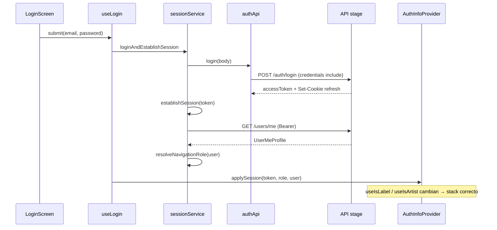
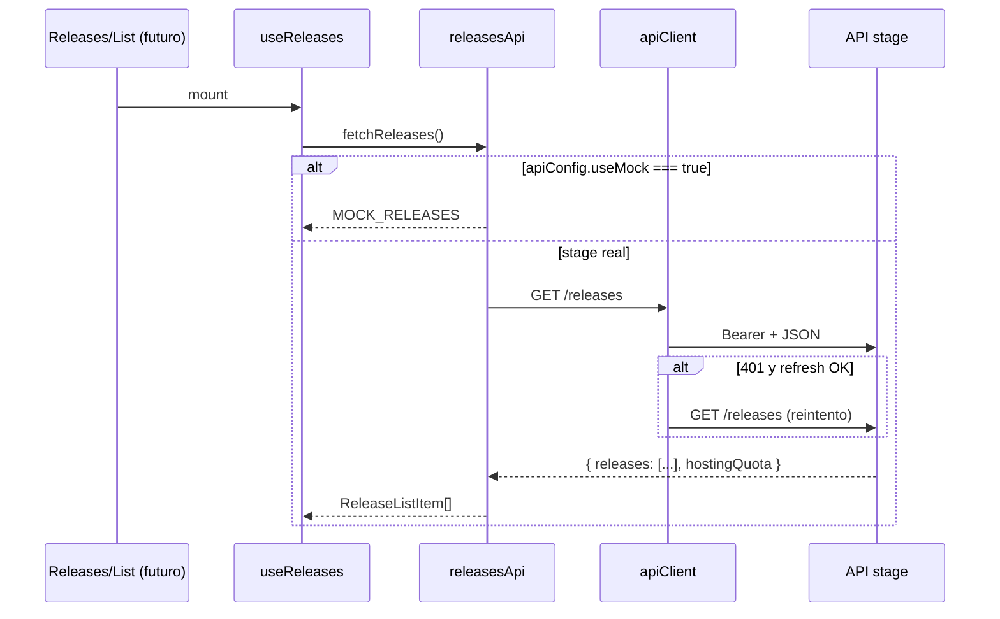

# Programación de dispositivos móviles

## Práctica 4 — Infra compartida, apiClient y primer HTTP real contra stage

**Prerrequisitos:**

- [CLASE_03_PRACTICA.md](./CLASE_03_PRACTICA.md) — organisms, mocks, `features/` + `services/api/`, estados de pantalla.
- [CLASE_03_PRACTICA_B.md](./CLASE_03_PRACTICA_B.md) — convenciones del curso, contrato HTTP y reglas de integración.
- Documentación HTTP vigente:
  - [REFERENCIA_API_R8.md](../REFERENCIA_API_R8.md) (v2026-06-30)
  - [DTOs_Y_CUERPOS_HTTP.md](../DTOs_Y_CUERPOS_HTTP.md) (v2026-06-30)

**Objetivos de esta clase:**

1. **Cerrar Fase 0** del [PLAN_TRABAJO_ALUMNOS_RN.md](../PLAN_TRABAJO_ALUMNOS_RN.md): `apiClient`, atoms/molecules compartidos y tipos mínimos en `main`.
2. Hacer **usable la navegación por rol** con auth de desarrollo y, como mínimo, **login real** contra stage (`POST /auth/login`).
3. Conectar **una pantalla** al patrón de la Clase 3 pero con **HTTP real** (lista de releases autenticada).
4. Aprender el **orden de merges** para integrar el trabajo fragmentado en ramas de alumnos sin romper `main`.

**Qué NO hace esta práctica (a propósito — temas reservados para Clase 5):**

- No persiste el token en **SecureStore** ni hace **bootstrap en splash** al abrir la app (la infra de `revalidateStoredSession` ya está lista para conectarla).
- No garantiza cookies de refresh en todos los entornos RN (puede requerir librería nativa); el código intenta `POST /auth/refresh` pero el flujo productivo se afina en Clase 5.
- No cubre flujos **guest** con `?token=` (player / inbox sin cuenta — Equipo 3).
- No implementa **presign + upload** de imágenes o audio.
- No conecta las 27 pantallas ni bottom tabs.

---

## 0. Estado actual del repo (leer antes de codear)

### `main` (punto de partida)

| Qué hay | Detalle |
|---------|---------|
| Navegación | React Navigation 7 — stacks Auth / Artist / Label |
| Pantallas | ~27 placeholders en `src/screens/` |
| Tokens | `src/constants/design.ts` |
| Componentes | Carpetas vacías (`.keep`) — **sin** atoms/molecules en `main` |
| API | `src/services/api/` — `apiClient`, auth, sesión, `fetchReleases` (mock por defecto) |
| Tipos | `src/types/auth/`, `src/types/releases/` |
| Auth | `AuthInfoProvider` con `applySession`, `loginDev`, `useLogin` (pantalla Login **sin cablear**) |

### Ramas con trabajo reutilizable (no mergeado)

| Rama | Qué aporta | Adaptar al integrar |
|------|------------|---------------------|
| `feat/login-components*` | Atoms: Button, Input, Checkbox, Spinner… | Rutas bajo `src/components/atoms/`; usar `constants/design` |
| `feat/state-molecules` | `LoadingBlock`, `EmptyState`, `ErrorState`, `ListRowCard` | Misma convención de carpetas |
| `feature/releases-api` | `config`, mocks, `releasesApi`, tipos release | Unificar con CLASE_03; Bearer en apiClient |
| `feature/releases` | `useReleases` hook | Depende de api + tipos |
| `feat/login-auth` | `login` / `logout` / `switchRole` en contexto | Base para dev + login real |
| `releases-screen` | Pantalla lista mock | **Ruta vieja** `screens/releases/` → `screens/Label/Releases/` |
| `dashboard2` | Dashboard con `fetch` a stage | **Sin Bearer** — no copiar tal cual; usar apiClient |

### Mensaje central

> La Clase 3 enseñó el **patrón** (mock + estados). La Clase 4 lo **aterriza en `main`** con infra compartida y el **primer flujo autenticado**. El cuello de botella actual no es falta de pantallas sino **integración**.

**API Stage:**

```text
https://api-stage.technopremieres.com
```

```bash
EXPO_PUBLIC_API_URL=https://api-stage.technopremieres.com
```

Health check: `GET /health` → **200**.

---

## Cómo leer cada paso

| Bloque | Significado |
|--------|-------------|
| **Qué** | Resultado concreto. |
| **Cómo** | Archivos, comandos, código. |
| **Por qué** | Decisión de diseño / curso. |
| **Cómo funciona** | React, hooks, HTTP, navegación. |

---

## 1. Hito transversal — `apiClient` y configuración

### Qué

Un único punto de salida HTTP para todo el curso: base URL, JSON, Bearer y errores legibles.

### Cómo

**Variable de entorno** (archivo `.env` en la raíz del proyecto, no commitear credenciales):

```bash
EXPO_PUBLIC_API_URL=https://api-stage.technopremieres.com
```

**Archivo:** `src/services/api/config.ts`

```ts
export const apiConfig = {
  baseUrl: (process.env.EXPO_PUBLIC_API_URL ?? '').replace(/\/$/, ''),
  useMock: true,
  mockDelayMs: 800,
} as const;
```

**Archivo:** `src/services/api/tokenStore.ts` — token en memoria (`clearAccessToken` incluido; SecureStore → Clase 5):

```ts
let accessToken: string | null = null;

export function getAccessToken(): string | null {
  return accessToken;
}

export function setAccessToken(token: string | null): void {
  accessToken = token;
}

export function clearAccessToken(): void {
  accessToken = null;
}
```

**Archivos relacionados:** `apiErrors.ts` (mensajes del body), `refreshApi.ts` (`POST /auth/refresh` con cookie).

**Archivo:** `src/services/api/apiClient.ts` — resumen del contrato en `main`:

```ts
// 1. buildUrl(path) → EXPO_PUBLIC_API_URL + path (+ ?token= opcional para guest)
// 2. Si hay token y no es skipAuth → Authorization: Bearer …
// 3. Si response.status === 401 y aún no se reintentó → attemptRefresh() → repetir una vez
```

> `login` y `refresh` usan `fetch` directo (sin Bearer) con `credentials: 'include'` para la cookie httpOnly de refresh. El resto de rutas autenticadas pasan por `apiClient`.

### Por qué

Sin `apiClient`, cada pantalla repite URL, headers y manejo de 401. El plan exige **una capa común** antes de que los cinco equipos sigan en paralelo.

### Cómo funciona

Todas las funciones en `services/api/*Service.ts` llaman a `apiClient`, no a `fetch` suelto. El token vive en `tokenStore` (y luego SecureStore); el contexto de auth lo actualiza tras login.

---

## 2. Hito transversal — Atoms y molecules en `main`

### Qué

Componentes compartidos mínimos para que las pantallas dejen de ser placeholders de texto.

### Cómo

**Prioridad de merge (PR chico, 1–2 personas + revisión del profe):**

1. Atoms: `AppText`, `PrimaryButton`, `LabeledTextField` (adaptar desde `feat/login-components*` si ya existen en ramas).
2. Molecules de estado: `LoadingBlock`, `EmptyState`, `ErrorState`, `ListRowCard` (desde `feat/state-molecules`).

**Convenciones:**

- Estilos desde `src/constants/design.ts` — **no** `src/design/tokens/`.
- Atoms/molecules **no** importan `services/api`.

**Estructura objetivo:**

```text
src/components/
├── atoms/
│   ├── AppText.tsx
│   └── PrimaryButton.tsx
└── molecules/
    ├── LabeledTextField.tsx
    ├── LoadingBlock.tsx
    ├── EmptyState.tsx
    ├── ErrorState.tsx
    └── ListRowCard.tsx
```

### Por qué

[CLASE_03_PRACTICA_B.md](./CLASE_03_PRACTICA_B.md) §2.1: sin UI compartida, cada rama reimplementa controles y los PR no compilan al integrar.

### Cómo funciona

La screen y el organism componen molecules; el hook trae datos. Misma separación que la Clase 3, pero con componentes reales en `main`.

---

## 3. Hito transversal — Tipos alineados a DTOs

### Qué

Interfaces TypeScript compartidas para release (y opcionalmente promo), alineadas a [DTOs_Y_CUERPOS_HTTP.md](../DTOs_Y_CUERPOS_HTTP.md) §5.

### Cómo

**Archivo:** `src/types/releases/release.ts`

```ts
export type ReleaseType = 'EP' | 'VA' | 'ALBUM';

export type ReleaseListItem = {
  id: string;
  title: string;
  artist: string;
  type: ReleaseType;
  releaseDate: string;
};

export type ReleasesListResponse = {
  releases: ReleaseListItem[];
  hostingQuota: { used: number };
  releaseAudioQuota?: { maxBytes: number };
};
```

**Archivo:** `src/types/releases/index.ts`

```ts
export type {
  ReleaseListItem,
  ReleaseType,
  ReleasesListResponse,
} from './release';
```

> **No usar** enums obsoletos (`REMIX`, `SINGLE`, `PUBLISHED`). Ver CLASE_03B §3.5.

### Por qué

El mock y la API deben compartir tipos. `GET /releases` devuelve un **objeto envuelto**, no un array plano.

### Cómo funciona

`fetchReleases` retorna `ReleaseListItem[]` al hook; internamente parsea `data.releases` del response.

---

## 4. Autenticación — infra en `main` y cableado en pantallas

### Qué

En `main` ya está la **capa de sesión** (login, revalidación, refresh ante 401). Los alumnos **cablean** el formulario de Login y, opcionalmente, el bootstrap al abrir la app.

| Capa | Estado en `main` | Quién lo toca en clase |
|------|------------------|-------------------------|
| `authApi`, `userApi`, `sessionService`, `apiClient` | Implementado | Revisar / extender si hace falta |
| `AuthInfoProvider`, `useLogin` | Implementado | Equipo Auth |
| `screens/Auth/Login.tsx` | Placeholder con TODO | Equipo Auth — conectar `useLogin` |
| Splash / SecureStore | No cableado | Clase 5 |

### Cómo (archivos clave)

| Archivo | Responsabilidad |
|---------|-----------------|
| `src/services/api/authApi.ts` | `POST /auth/login` — sin Bearer; `credentials: 'include'` |
| `src/services/api/userApi.ts` | `GET /users/me` — revalida que el JWT sea aceptado |
| `src/services/api/sessionService.ts` | Orquesta login → establish → rol; `revalidateStoredSession` |
| `src/services/api/refreshApi.ts` | `POST /auth/refresh` — renueva accessToken con cookie |
| `src/services/api/apiClient.ts` | Bearer automático; reintento tras 401 |
| `src/features/auth/info.tsx` | Contexto React: `applySession`, `logout`, `loginDev`, `user` |
| `src/features/auth/useLogin.ts` | Hook para la pantalla Login |

#### 4.1 `AuthInfoProvider` (ya en `main`)

El contexto expone:

- `authInfo` — `{ isAuthenticated: false }` o `{ isAuthenticated: true, role }`.
- `user` — perfil de `GET /users/me` tras login o revalidación.
- `loginDev(role)` — entrar a un stack sin llamar al API (desarrollo).
- `logout()` — `clearSession()` + reset de contexto.
- `applySession(accessToken, role, user)` — lo llama `useLogin` (o un futuro splash); **no** lo invocan pantallas sueltas.

Los hooks `useIsAuthenticated`, `useIsArtist`, `useIsLabel` leen `authInfo` correctamente (el stub viejo devolvía el contexto entero — bug corregido).

#### 4.2 Hook `useLogin` (ya en `main`)

```ts
const session = await loginAndEstablishSession({ email, password });
applySession(session.accessToken, session.role, session.user);
```

No infiere el rol a mano: `sessionService` llama a `GET /users/me` y usa `resolveNavigationRole`.

#### 4.3 Tarea del equipo Auth — cablear Login

En `src/screens/Auth/Login.tsx` (placeholder):

```tsx
import { useLogin } from '../../features/auth/useLogin';

// En el submit del formulario:
const { submit, loading, error } = useLogin();
await submit(email, password);
// Si no hay error, la navegación cambia sola vía useIsArtist / useIsLabel
```

#### 4.4 Persistencia (Clase 5)

`revalidateStoredSession()` ya está lista para un splash futuro. Falta guardar/restaurar el token con `expo-secure-store` y llamar a `applySession` al arrancar.

---

## 4.5 Referencia detallada — login, revalidación de sesión y request autenticado

Esta sección describe **el flujo completo** que el API de stage exige y cómo está modelado en el código de `main`. Léela antes de cablear pantallas o depurar 401.

### Por qué el API exige revalidar

`POST /auth/login` devuelve un `accessToken`, pero **no basta** guardarlo en memoria y navegar:

1. El JWT puede ser válido en formato pero **rechazado** por el servidor (usuario deshabilitado, rotación, etc.).
2. La **navegación por rol** (`artist` vs `label`) debe basarse en el perfil real (`labels[]`, `artist`), no en suposiciones del cliente.
3. Cualquier endpoint protegido (p. ej. `GET /releases`) asume una sesión **aceptada** por el backend.

Por eso, tras cada login (y al restaurar sesión), el cliente llama a **`GET /users/me`** con el Bearer. Si falla, se limpia el token y se trata como no autenticado.

Además, el API emite una **cookie httpOnly de refresh** en login. Cuando el accessToken expira, el cliente puede llamar a **`POST /auth/refresh`** (con `credentials: 'include'`) para obtener un nuevo JWT sin pedir contraseña otra vez.

### Diagrama del flujo de login



### Paso a paso — `loginAndEstablishSession`

**1. Login (`authApi.login`)**

```http
POST /auth/login
Content-Type: application/json
credentials: include

{ "email": "...", "password": "..." }
```

Respuesta esperada:

```json
{ "success": true, "accessToken": "eyJ..." }
```

El navegador/RN también recibe la cookie de refresh (no accesible desde JS).

**2. Establecer sesión (`establishSession`)**

```ts
setAccessToken(accessToken);
const user = await fetchUsersMe(); // GET /users/me vía apiClient
const role = resolveNavigationRole(user);
```

- Si `GET /users/me` falla → `clearAccessToken()` y se propaga el error (login “técnicamente” OK pero sesión inválida).
- `resolveNavigationRole`: si `user.labels?.length > 0` → `label`; si no, `artist` si existe `user.artist`; si ninguno → error explícito.

**3. Actualizar UI (`applySession`)**

El hook guarda token (redundante pero seguro), `user` y `role` en el contexto. React Navigation, que ya lee `useIsAuthenticated` / `useIsArtist` / `useIsLabel`, muestra el stack sin tocar `navigation/` manualmente.

### Revalidación al abrir la app — `revalidateStoredSession`

Cuando en Clase 5 persistan el token (SecureStore), el splash hará algo equivalente a:

```ts
const session = await revalidateStoredSession();
if (session) {
  applySession(session.accessToken, session.role, session.user);
} else {
  // quedarse en Auth stack
}
```

Lógica interna:

1. Si no hay token en `tokenStore` → intenta `attemptRefresh()` (por si solo queda la cookie).
2. Llama `GET /users/me`.
3. Si devuelve **401** → `attemptRefresh()` → si hay nuevo token, **reintenta** `GET /users/me` una vez.
4. Si sigue fallando → `clearAccessToken()` y retorna `null`.

Así se cumple el contrato del API: **no se asume** que un token guardado sigue siendo válido.

### Refresh automático en requests — `apiClient`

Cualquier llamada autenticada (`fetchReleases`, `fetchUsersMe`, etc.) pasa por `apiClient`:

```text
apiClient('/releases')
  → doFetch con Authorization: Bearer <token>
  → si status === 401 y no es skipAuth:
       attemptRefresh()
       → si OK: doFetch otra vez (una sola vez, flag __retriedAfterRefresh)
       → si falla: el caller recibe 401
```

Esto evita que la lista de releases falle en silencio cuando el accessToken expiró pero la cookie de refresh sigue viva.

> **Limitación RN:** `credentials: 'include'` y cookies httpOnly no siempre se comportan igual que en el navegador. Si refresh falla en dispositivo real, relogin manual o librería de cookies (Clase 5). En simulador con stage suele bastar para la práctica.

### Ejemplo canónico — `fetchReleases` (request autenticado)

**Archivo:** `src/services/api/releasesApi.ts` (ya en `main`).



Código relevante:

```ts
export async function fetchReleases(): Promise<ReleaseListItem[]> {
  if (apiConfig.useMock) {
    await wait(apiConfig.mockDelayMs);
    return [...MOCK_RELEASES];
  }

  const response = await apiClient('/releases');
  if (!response.ok) {
    throw await readApiError(response, 'No se pudo cargar releases');
  }
  const data = await response.json();
  return Array.isArray(data) ? data : data.releases ?? [];
}
```

**Requisitos para que funcione contra stage:**

1. `EXPO_PUBLIC_API_URL` en `.env` (ver `.env.example`).
2. `apiConfig.useMock = false` en `config.ts` cuando quieran datos reales.
3. Usuario logueado con rol **label** (`GET /releases` es endpoint de sello).
4. Login previo vía `useLogin` (o `loginDev('label')` solo navega — **no** pone Bearer válido).

**Qué cablean los alumnos (Equipo 4):** hook `useReleases` + pantalla `Label/Releases/List` — **no** reimplementar `fetch` ni el Bearer; importar `fetchReleases` desde `services/api/releasesApi`.

### Tabla de endpoints de esta práctica

| Endpoint | Auth | Cuándo se usa |
|----------|------|----------------|
| `POST /auth/login` | No (body email/password) | Inicio de sesión |
| `GET /users/me` | Bearer | Revalidar sesión; resolver rol |
| `POST /auth/refresh` | Cookie httpOnly | Token expirado; bootstrap |
| `POST /auth/validate` | Bearer | Alternativa explícita (web); opcional en mobile |
| `GET /releases` | Bearer (label) | Ejemplo de lista autenticada |

### Errores frecuentes en este flujo

| Síntoma | Causa probable | Dónde mirar |
|---------|----------------|-------------|
| Login OK pero 401 en `/releases` | `useMock: false` sin login real, o usuario artista | `useLogin`, rol en `applySession` |
| Siempre mock | `apiConfig.useMock: true` | `config.ts` |
| Login OK pero sigue en Auth | No se llamó `applySession` | `useLogin`, provider en `index.tsx` |
| 401 en todo tras un rato | Refresh/cookie no persiste en RN | `refreshApi`, relogin; Clase 5 |
| `GET /users/me` falla tras login | Token mal copiado o stage caído | `establishSession`, red, `.env` |

### Por qué (resumen pedagógico)

Sin auth usable, los equipos 2–5 no prueban sus stacks. El patrón **login → revalidar con `/users/me` → requests con `apiClient`** es el mismo que usa el sitio web (`r8-site`); la app mobile solo añade `tokenStore`, refresh y hooks de React.

### Cómo funciona (una línea)

`tokenStore` + `apiClient` manejan el Bearer y el refresh; `sessionService` valida contra el API; el contexto React traduce el resultado en navegación por rol.

---

## 5. Primera pantalla con HTTP real — lista de releases

### Qué

Conectar `Label/Releases/List` al patrón Clase 3 con `useMock: false` y Bearer. **`fetchReleases` ya está en `main`** (ver §4.5); falta el hook y la pantalla.

### Cómo

**Ya implementado:** `src/services/api/releasesApi.ts` — usa `apiClient`, mock con `useMock: true` por defecto.

**Pendiente en equipos:**

**Screen** `src/screens/Label/Releases/List.tsx`:

- Llama `useReleases()`.
- Renderiza `LoadingBlock` / `ErrorState` / `EmptyState` / organism con `ListRowCard`.
- `onPress` → `navigation.navigate('Details', { releaseId: item.id })`.

**Registrar parámetro en navegación** (`src/navigation/index.tsx`):

```ts
Details: {
  screen: LabelReleasesDetailsScreen,
  linking: { path: 'releases/:releaseId' },
},
```

Y tipar `releaseId` en el stack param list cuando el equipo agregue TypeScript estricto a rutas.

### Por qué

Demuestra el circuito completo: **login → token → GET autenticado → UI con estados**. Equipo 4 extiende después a detalle (`GET /releases/:releaseId`).

### Cómo funciona

```text
LoginScreen → useLogin → sessionService → authApi + GET /users/me → applySession → tokenStore
LabelReleasesListScreen → useReleases → releasesApi → apiClient + Bearer (+ refresh si 401)
```

Si aparece **401** tras agotar refresh: volver a login. Ver §4.5.

---

## 6. Integración de ramas — orden y reglas

### Qué

Mergear trabajo de alumnos sin romper Metro ni duplicar infra.

### Cómo

**Orden sugerido de PRs a `main`:**

| # | PR | Contenido |
|---|-----|-----------|
| 1 | `chore/atoms-base` | AppText, PrimaryButton, LabeledTextField |
| 2 | `chore/state-molecules` | Loading, Empty, Error, ListRowCard |
| 3 | `chore/types-releases` | Tipos según DTOs |
| 4 | `feat/api-client` | config, tokenStore, apiClient |
| 5 | `feat/auth-login` | authApi, useLogin, AuthInfoProvider |
| 6 | `feat/releases-list-stage` | useReleases + pantalla List |

**Reglas (repaso CLASE_03B):**

- Rama **corta** por feature; **rebase** frecuente sobre `main`.
- Antes del PR: `npm start` sin errores de import.
- **No** mezclar infra + 5 pantallas en un solo PR.
- Adaptar imports: `constants/design`, `screens/Label/...`, no `design/tokens` ni `App.tsx`.

**Ramas a adaptar, no copiar literal:**

| Rama | Acción |
|------|--------|
| `releases-screen` | Mover a `Label/Releases/List`; corregir imports |
| `dashboard2` | Reemplazar `fetch` suelto por `apiClient` + login previo |
| `feat/promo-details-mock` | Ignorar si apunta a `App.tsx` obsoleto |

### Por qué

El repo tiene buen volumen de código en ramas remotas pero **fragmentado**. La Clase 4 es tanto código como **proceso de equipo**.

### Cómo funciona

Cada PR deja `main` compilable. Los equipos rebasean su trabajo encima de la infra ya mergeada.

---

## 7. Reparto por equipo (orientativo)

| Equipo | Enfoque Clase 4 | Evitar |
|--------|-----------------|--------|
| **1 — Auth** | Login stage, `useLogin`, resolver rol con `GET /users/me`, `loginDev` | Recrear `App.tsx` |
| **2 — Label** | Probar Dashboard/Profile **después** de login label | `fetch` sin Bearer |
| **3 — Player** | Seguir con mock local; guest `?token=` → Clase 5 | Asumir dismiss sin rol `guest` |
| **4 — Releases** | Lista + detalle con `releaseId`; tipos `EP/VA/ALBUM` | Array plano en `GET /releases` |
| **5 — Lists** | Mocks locales hasta tener apiClient en `main` | `bulk-upload` multipart |
| **Transversal** | PRs 1–4 de la tabla §6 | PR gigante |

---

## 8. Ejercicios en vivo (profesor)

| Ejercicio | Acción | Qué observar |
|-----------|--------|--------------|
| Health | `GET /health` en navegador o curl | 200 sin auth |
| Sin token | `GET /releases` sin login | 401 |
| Login | Credenciales de stage en Login | Token en memoria; stack Label o Artist |
| Lista real | Abrir Releases/List logueado como label | Datos o empty; no crash por `data.releases` |
| Mock fallback | `useMock: true` en config | Misma UI que Clase 3 |
| Dev bypass | `loginDev('artist')` | Stack Artist sin stage |
| Error UI | Credenciales inválidas | Mensaje en pantalla, no pantalla blanca |

---

## 9. Checklist de entrega (Clase 4)

### Infra transversal (objetivo merge a `main`)

- [x] `EXPO_PUBLIC_API_URL` documentado (`.env.example`) y probado (`GET /health`).
- [x] `src/services/api/config.ts`, `tokenStore.ts`, `apiClient.ts`, `refreshApi.ts`, `sessionService.ts`.
- [ ] Atoms mínimos en `src/components/atoms/`.
- [ ] Molecules de estado en `src/components/molecules/`.
- [x] `src/types/releases/` y `src/types/auth/` alineados a DTOs.

### Auth

- [x] `AuthInfoProvider` con `applySession`, `logout`, `loginDev` y `user`.
- [x] `authApi.login` → `POST /auth/login`; revalidación `GET /users/me`.
- [x] `useLogin` con `loginAndEstablishSession`.
- [ ] `useLogin` conectado a `Login` screen (organism `LoginForm` opcional).
- [ ] Tras login, navegación al stack correcto (depende del cableado anterior).

### Primera pantalla real

- [x] `releasesApi.fetchReleases` usa `apiClient` y parsea `data.releases`.
- [ ] `useReleases` + estados loading/error/empty/success.
- [ ] `Label/Releases/List` accesible desde navegación label.
- [ ] (Opcional) Navegación a detalle con `releaseId`.

### Integración

- [ ] Al menos un PR de infra mergeado siguiendo orden §6.
- [ ] Rama de equipo rehecha sobre `main` actualizado.
- [ ] `npm start` sin errores de import.

---

## 10. Qué sigue — Clase 5 (temas secundarios diferidos)

1. **Persistencia y splash** — SecureStore + `revalidateStoredSession()` al abrir la app (la función ya existe).
2. **Cookies en RN** — afinar `POST /auth/refresh` con librería nativa si `credentials: 'include'` no basta en dispositivo.
3. **Perfil artista lectura** — `GET /artists/me`, avatar, Fase 1 del plan.
4. **Flujo guest** — inbox y player con `?token=` (Equipo 3).
5. **Presign + upload** — imagen de perfil y artwork de release.
6. **Detalle release completo** — `GET /releases/:releaseId` con `tracks[].audioUrl`.

Ver borrador de temas en la sección 10 de este documento; el docente publicará `CLASE_05_PRACTICA.md` cuando corresponda.

---

## 11. Errores típicos en esta práctica

| Síntoma | Causa | Qué revisar |
|---------|--------|-------------|
| `401` en todo endpoint | Sin login o token no en `tokenStore` | `applySession` tras login |
| `Network request failed` | URL mal configurada o sin red | `EXPO_PUBLIC_API_URL`, reiniciar Expo tras cambiar `.env` |
| Lista vacía con 200 | Parseo incorrecto | `data.releases`, no `res.json()` como array |
| `Unable to resolve design/tokens` | Rama vieja | `constants/design` |
| Pantalla label sin datos | Usuario artista logueado | Rol correcto en `applySession` / `GET /users/me` |
| Imports rotos tras merge | Paths de otra convención | `screens/Label/Releases/` |
| Login OK pero sigue en Auth stack | Contexto no actualizado | `AuthInfoProvider` envuelve navegación en `index.tsx` |

---

## 12. Referencias rápidas

| Tema | Archivo |
|------|---------|
| Rutas y auth mobile | [REFERENCIA_API_R8.md](../REFERENCIA_API_R8.md) |
| DTOs login y releases | [DTOs_Y_CUERPOS_HTTP.md](../DTOs_Y_CUERPOS_HTTP.md) |
| Fase 0 y equipos | [PLAN_TRABAJO_ALUMNOS_RN.md](../PLAN_TRABAJO_ALUMNOS_RN.md) |
| Deuda técnica | [CLASE_03_PRACTICA_B.md](./CLASE_03_PRACTICA_B.md) |
| Cliente web referencia | `r8-site/src/utils/api.ts`, `r8-site/src/api/user.ts` |
| Pantalla releases label | [EQUIPO_4_FUNCIONAL.md](../EQUIPO_4_FUNCIONAL.md) |
| Login y sesión (§4.5) | [EQUIPO_1_FUNCIONAL.md](../EQUIPO_1_FUNCIONAL.md), `src/services/api/sessionService.ts` |

---

*Documento de práctica 4 — infra compartida, apiClient y primer HTTP real (2026-06-30).*
