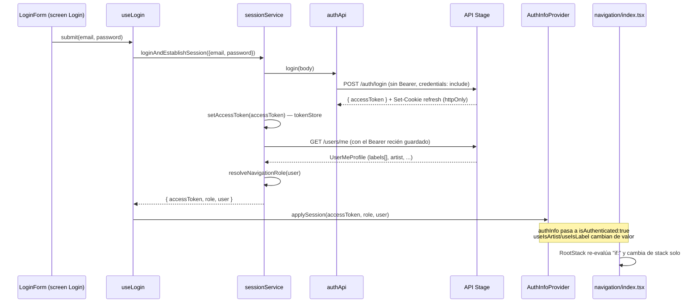
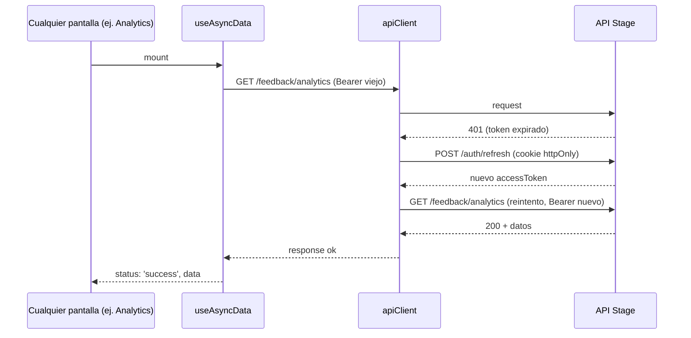

# Programación de dispositivos móviles

## Práctica 5 — Login real, 5 pantallas de lectura y cómo se valida cada request

**Prerrequisitos:**

- [CLASE_04_PRACTICA.md](./CLASE_04_PRACTICA.md) — `apiClient`, `tokenStore`, `sessionService`, y el flujo de login/sesión en detalle (§4.5 de esa práctica sigue siendo la referencia completa; acá no se repite todo, se retoma).
- [ATOMIC_DESIGN.md](../ATOMIC_DESIGN.md) — convención de atoms/molecules/organisms/screens.
- [DTOs_Y_CUERPOS_HTTP.md](../DTOs_Y_CUERPOS_HTTP.md) (actualizado en este mismo PR) y [REFERENCIA_API_R8.md](../REFERENCIA_API_R8.md).
- PR de esta clase: rama `feat/batch-login-y-lecturas` → `main`.

**Objetivos de esta clase:**

1. Entender **por qué existe este PR** y qué resuelve concretamente para cada equipo.
2. Dejar completamente claro **cómo funciona el login, la sesión, y cómo cada request valida que el usuario está autenticado** — es la pregunta que más van a hacer, así que tiene su propia sección larga con diagramas y código real.
3. Recorrer, pantalla por pantalla, **qué se construyó y por qué se armó así** (solo lectura + un único write, botones de escritura deshabilitados, componentes compartidos vs. específicos).
4. Dejar en claro **qué NO se tocó a propósito** y qué le queda a cada equipo para seguir practicando.
5. Dar una checklist de entrega actualizada por equipo, y los errores típicos que aparecieron armando este PR (van a pisar los mismos).

**Qué NO hace este PR (a propósito):**

- No hay CRUD real en ningún lado (crear/editar release, promo, lista de destinatarios). Los botones están, pero deshabilitados — esa parte queda para que cada equipo la practique de verdad. Mientras tanto, para probar flujos de escritura, se puede usar **la web de Stage** con el mismo usuario.
- No toca **Releases** (`ReleasesListScreen`, `types/releases`, `releasesApi`) — ese dominio tiene 5 PRs de alumnos en conflicto entre sí ahora mismo, mejor no meter una sexta versión en el medio.
- No persiste el token en **SecureStore** ni arma la pantalla de **Splash** — sigue pendiente de Clase 4/5 (ver §8).
- No cubre el flujo **guest** de Liked Tracks (`?token=` sin login) — solo el caso de artista autenticado.
- El tab bar que se agregó es **mínimo y transitorio**, para poder probar este PR — no es el rediseño de navegación real (ver §6).

---

## 0. Por qué existe este PR

Antes de tocar código, el profe (con ayuda de Claude Code) revisó el estado real del repo: qué le tocaba a cada equipo, qué había en `main`, y qué había en las ramas y PRs abiertos de todos. Encontró tres cosas:

1. **`main` tenía la infra de auth completa** (login, sesión, `apiClient`) desde la Clase 4, pero **cero componentes** (`atoms/`, `molecules/`, `organisms/` vacías) y **26 de 27 pantallas eran placeholders**. Solo `Login.tsx` tenía un TODO explícito.
2. **Login ya tenía gente trabajando**, pero en un tren de ramas de integración (`feat/login` ← `feat/login-components` ← `feat/login-components-<atomo>`) que nunca llegó a `main` — y peor, esas ramas son **anteriores a la infra de Clase 4**: si se mergearan tal cual hoy, romperían `useLogin`/`sessionService`/`apiClient`. No es que el profe lo haya "hecho mejor", es que esas ramas quedaron desalineadas con la base de código actual.
3. **Releases estaba saturado**: 5 alumnos distintos con PRs pisándose los mismos archivos, casi todos en conflicto.

Con ese diagnóstico, la idea fue: **una sola rama, muchos commits chicos**, con Login (que todos necesitan para poder probar cualquier otra cosa) más **una pantalla de lectura por equipo**, eligiendo territorio que no chocara con nada abierto. El resultado es este PR — se puede revisar y probar commit por commit, no hace falta esperar a que esté todo mergeado.

### Selección de pantalla por equipo (y por qué)

| Equipo | Pantalla | Por qué esta y no otra |
|--------|----------|------------------------|
| 1 | **Perfil Artista** (lectura) | Es su segundo hito real después de Login (ver `PLAN_TRABAJO_ALUMNOS_RN.md`, Fase 1). El Inbox del reproductor es del Equipo 3, no de ellos. |
| 2 | **Analytics** | Dashboard ya tenía una PR de un alumno activa y mergeable (#22) — no tenía sentido pisarla. Analytics es solo-lectura por naturaleza, cero PRs tocándolo. |
| 3 | **Liked Tracks** (+ el único write) | Promos Player ya tenía una PR de un alumno en curso (#21). Liked Tracks es lectura simple, y trae naturalmente el único write con sentido de todo el batch (sacar un track de favoritos). |
| 4 | **Promos lado label (listado)** | Releases es el embudo de 5 PRs en conflicto — no se toca. Promos-label es el mismo dominio del equipo, sin ningún PR encima. |
| 5 | **Recipient Lists (listado)** | El equipo con menos avance (~5% según el informe interno de colaboradores) y sin ninguna rama/PR propia todavía — el que más se beneficia de un empujón. |

---

## Credenciales de test (compartidas para todo el curso)

Creadas exclusivamente para pruebas — no son cuentas de nadie, úsenlas libremente en clase:

```text
Label:  rpruebas.label@frantest.com   / Rpruebas1
Artist: rpruebas.artist@frantest.com  / Rpruebas1
```

Como la app mobile de este PR es **solo lectura** (salvo el único write de Liked Tracks, ver §3.3),
la forma de generar datos nuevos para probar es **loguearse con estas mismas credenciales en la web
de Stage** (`https://r8-site-stage.pages.dev` o el dominio que tengan configurado) y hacer ahí los
cambios de escritura: crear una promo, mandar feedback, armar una lista de destinatarios, etc.
Como mobile y web pegan contra **el mismo backend y la misma base de datos** (`https://api.stage.r8.audio`),
cualquier cambio que hagan en la web se va a ver reflejado en mobile la próxima vez que esa pantalla
haga su `GET` — no hay ninguna sincronización especial, es literalmente la misma fuente de datos.
Buen ejercicio en vivo: crear una promo nueva en la web logueados como `rpruebas.label`, después
abrir mobile y entrar al tab **Promos** — debería aparecer sin tocar nada del código.

---

## Cómo leer cada sección

Igual que en la Clase 4: **Qué** (resultado concreto), **Cómo** (archivos/código), **Por qué** (la decisión), **Cómo funciona** (el mecanismo interno).

---

## 1. Login — de infra a pantalla real

### Qué

En Clase 4 quedó la **infraestructura** de sesión (`useLogin`, `AuthInfoProvider`, `sessionService`, `apiClient`) pero `Login.tsx` seguía siendo un placeholder. Este PR construye la pantalla real, siguiendo Atomic Design de punta a punta.

### Cómo

```text
src/components/atoms/AppText.tsx        — texto con la tipografía del curso, no estilos sueltos
src/components/atoms/Button.tsx         — primary/secondary, con loading
src/components/atoms/Input.tsx          — TextInput controlado
src/components/atoms/ErrorMessage.tsx   — error de un campo puntual
src/components/molecules/LabeledInput.tsx  — label + Input + error
src/components/organisms/LoginForm.tsx  — arma el form completo, SIN HTTP
src/screens/Auth/Login.tsx              — conecta LoginForm con useLogin
```

`LoginForm` es un organismo puro — recibe `email`, `password`, callbacks de cambio, `onSubmit`, `loading`, `error` por props. **No** importa nada de `services/api`. Quien conecta con la red es la screen:

```tsx
// src/screens/Auth/Login.tsx (resumen)
const [email, setEmail] = useState('');
const [password, setPassword] = useState('');
const { submit, loading, error } = useLogin(); // ya existía desde Clase 4

<LoginForm
  email={email} password={password}
  onChangeEmail={setEmail} onChangePassword={setPassword}
  onSubmit={() => submit(email, password)}
  loading={loading} error={error}
/>
```

### Por qué

Es la regla de `ATOMIC_DESIGN.md` §4: la UI nunca llama a la API directamente, siempre sube el evento a la screen vía props/callback, y la screen es quien orquesta el hook. Así `LoginForm` se puede testear sin mockear red (ver §7), y en teoría hasta se podría reusar en otro contexto sin arrastrar HTTP.

### Cómo funciona

Nada de la lógica de sesión cambió respecto a Clase 4 — `useLogin` sigue llamando a `loginAndEstablishSession` igual que antes. Lo que cambió es que ahora hay un formulario real conectado a ese hook. El detalle completo de qué hace `loginAndEstablishSession` está en la §2 de esta clase (y en CLASE_04 §4.5, que sigue vigente).

---

## 2. Cómo funciona el login, la sesión, y la validación de cada request

Esta es la sección que más les van a preguntar. Ya estaba explicada en profundidad en CLASE_04 §4.5 — acá se retoma con el foco puesto en **lo que ahora es código real y corriendo**, no solo infra a la espera de que alguien la use.

### 2.1 Las tres cosas que hay que separar mentalmente

1. **Login** — cambiar credenciales por un `accessToken`. Pasa **una sola vez**, cuando el usuario toca "Ingresar".
2. **Sesión** — el `accessToken` viviendo en memoria (`tokenStore.ts`) mientras la app está abierta, más el `user`/`role` en el contexto de React (`AuthInfoProvider`).
3. **Autenticación por request** — cada vez que cualquier pantalla pide datos (`GET /artists/me`, `GET /feedback/analytics`, etc.), ese pedido tiene que probar que es un usuario válido. Eso lo hace `apiClient` automáticamente, no cada pantalla a mano.

Estas tres cosas están en archivos distintos y no se mezclan:

| Capa | Archivo | Responsabilidad |
|------|---------|------------------|
| Login (una vez) | `src/services/api/authApi.ts` | `POST /auth/login` |
| Sesión (mientras la app está abierta) | `src/services/api/tokenStore.ts` | Guarda/lee el `accessToken` en una variable en memoria |
| Sesión (React) | `src/features/auth/info.tsx` | `AuthInfoProvider` — expone `user`, `role`, `logout`, `applySession` |
| Auth por request | `src/services/api/apiClient.ts` | Agrega el `Authorization: Bearer` a **todo** lo que pase por acá, y reintenta si expiró |
| Orquestación del login completo | `src/services/api/sessionService.ts` | Encadena login → validar sesión → resolver rol |

### 2.2 El flujo completo, paso a paso



**El punto que más se presta a confusión**: el `accessToken` que devuelve `POST /auth/login` **no alcanza por sí solo**. El código además llama a `GET /users/me` con ese token, por dos motivos:

1. El JWT puede tener formato válido pero estar rechazado por el servidor (usuario deshabilitado, etc.) — no hay forma de saberlo sin usarlo.
2. El **rol** (`artist` vs `label`) sale del perfil real (`labels[]`, `artist` en la respuesta de `/users/me`), no se adivina del lado del cliente. Esto lo resuelve `resolveNavigationRole` en `sessionService.ts`.

### 2.3 Cómo cada request prueba que el usuario está autenticado

Ninguna pantalla arma un `fetch` a mano. Todas pasan por `apiClient`:

```ts
// src/services/api/apiClient.ts (resumen del contrato)
export async function apiClient(path, init = {}) {
  let response = await doFetch(path, init); // agrega Authorization: Bearer <token> si hay uno guardado

  if (response.status === 401 && !init.skipAuth && !init.__retriedAfterRefresh) {
    const refreshed = await attemptRefresh();      // POST /auth/refresh con la cookie httpOnly
    if (refreshed) {
      response = await doFetch(path, { ...init, __retriedAfterRefresh: true }); // reintenta UNA vez
    }
  }

  return response;
}
```

Esto significa que **cualquier** `fetchX()` nuevo que armen (como los de este PR: `fetchArtistMe`, `fetchLabelAnalytics`, `fetchPromosForLabel`, `fetchRecipientLists`, `fetchLikedTracks`) queda automáticamente autenticado con solo usar `apiClient` en vez de `fetch` — no hay que copiar el manejo de Bearer ni de 401 en cada uno. Ejemplo real de este PR:

```ts
// src/services/api/artistApi.ts
export async function fetchArtistMe(): Promise<ArtistProfile> {
  const response = await apiClient('/artists/me'); // el Bearer se agrega solo acá adentro
  if (!response.ok) {
    throw await readApiError(response, 'No se pudo cargar el perfil de artista');
  }
  return response.json();
}
```

### 2.4 Qué pasa si el token expiró a mitad de sesión



Si el refresh **también** falla (cookie vencida, o no persiste bien en RN — ver la limitación de abajo), la pantalla recibe el 401 tal cual y `useAsyncData` lo muestra como `status: 'error'` con `ErrorState` + botón "Reintentar". No hay redirect automático a Login todavía — eso es una mejora pendiente (podría engancharse a `logout()` cuando el refresh falla dos veces seguidas).

> **Limitación conocida, ya estaba documentada en Clase 4**: `credentials: 'include'` y cookies httpOnly no siempre se comportan igual en React Native que en un navegador. En simulador/web contra stage suele andar; en dispositivo real puede necesitar una librería de cookies nativa. No se resolvió en este PR.

### 2.5 Cerrar sesión (nuevo en este PR)

`logout()` ya existía en `AuthInfoProvider` desde Clase 4 (`clearSession()` + reset del contexto), pero no estaba conectado a ningún botón. Este PR lo agrega en **Perfil Artista** y **Perfil Label**:

```tsx
const { logout } = useAuthActions();
// ...
<Button label="Cerrar sesión" variant="secondary" onPress={logout} />
```

Al tocarlo: se limpia el `accessToken` de `tokenStore`, el contexto pasa a `isAuthenticated: false`, y `RootStack` (que ya escucha `useIsNotAuthenticated`) vuelve solo al stack de Auth — **sin recargar la app**. Es la forma más rápida de probar con distintos usuarios en la misma sesión de Expo.

### 2.6 El patrón de hook que usan las 5 pantallas de lectura

Todas las pantallas nuevas (menos Login) siguen el mismo patrón, montado sobre un hook base nuevo de este PR:

```ts
// src/hooks/useAsyncData.ts (nuevo en este PR)
export function useAsyncData(fetchFn) {
  // { status: 'loading' } → { status: 'success', data } | { status: 'error', message }
  // + reload() para el botón "Reintentar" de ErrorState
}

// src/features/artist/useArtistProfile.ts
export function useArtistProfile() {
  return useAsyncData(fetchArtistMe); // una línea
}
```

La screen nunca llama a `fetchArtistMe` directamente — siempre pasa por el hook de `features/`, que es quien decide *cuándo* pedir los datos. Esto es la misma separación screen → hook → `services/api` que ya enseñaba Clase 3, con `apiClient` haciendo la parte de auth por debajo sin que nadie tenga que pensarlo pantalla por pantalla.

---

## 3. Recorrido pantalla por pantalla

### 3.1 Perfil Artista (Equipo 1) — `Artist/Profile/View.tsx`

`GET /artists/me` — trae `profileImageUrl` resuelto en la misma respuesta, así que **no** hace falta el segundo call a `/artists/me/profile-image` para una pantalla de solo lectura (si sí construyen la edición de foto, ahí sí lo van a necesitar, vía presign).

Componentes nuevos: átomo `Avatar` (imagen circular con fallback de iniciales — lo va a poder reusar el Equipo 2 en Perfil Label sin reescribirlo) y molécula `ProfileField` (label + valor, misma razón).

### 3.2 Analytics (Equipo 2) — `Label/Analytics.tsx`

`GET /feedback/analytics` — el endpoint devuelve muchísimo más de lo que se renderiza acá (`trends`, `funnelCounts` con series diarias/semanales/mensuales). Se usa solo `overall` + `byRelease` a propósito: una pantalla con gráficos de tendencia es otro proyecto (necesitaría elegir una librería de charts), no algo para meter de paso en este batch.

### 3.3 Liked Tracks + el único write (Equipo 3) — `Artist/Promos/LikedTracks.tsx`

Es la única pantalla con un **write real**: `PATCH /releases/:releaseId/feedback/:feedbackId/track-stats/liked` con `{ track_id, liked: false }` — "quitar de favoritos". El `feedbackId` sale del mismo item que devuelve `GET /feedback/liked-tracks`, no hay que pedirlo aparte.

El hook (`useLikedTracks`) hace **update optimista**: saca el track de la lista al toque, y si el PATCH falla, no intenta "revertir a mano" — vuelve a pedir la lista real. Vale la pena leerlo (`src/features/feedback/useLikedTracks.ts`) como ejemplo de cómo manejar un write con estado local editable sin perder la fuente de verdad del servidor.

Solo cubre el caso de **artista autenticado** (Bearer). El flujo guest con `?token=` queda para el Equipo 3 — es más complejo porque además de la API hay que resolver deep links, algo que la navegación de la app todavía no tiene armado.

### 3.4 Promos lado label (Equipo 4) — `Label/Releases/Promos/List.tsx`

`GET /promos/for-label?labelId=` — el `labelId` sale de `useAuthUser().labels[0].id` (ya viene en el perfil de `/users/me`, no se pide aparte). Ojo con esto: `UserMeProfile` **no tiene un campo `labelId` plano** — hay que usar `labels[0]?.id`. Antes de este PR el tipo tenía un `labelId` que en realidad nunca existió en la respuesta real de stage (se corrigió acá, ver `fix: UserMeProfile.artist en camelCase...`).

### 3.5 Recipient Lists (Equipo 5) — `Label/RecipientLists/List.tsx`

`GET /recipient-lists` — el único de los 5 endpoints que ya estaba 100% bien documentado desde el principio (`RecipientListsIndexResponse`), sin sorpresas contra stage real.

### 3.6 El patrón "lectura real + botón de escritura deshabilitado"

En Perfil Artista, Promos-label y Recipient Lists van a ver botones tipo "Editar", "Nueva promo", "Nueva lista", "Cargar CSV" — **visibles pero sin acción** (`disabled`, `onPress={() => {}}`). La idea: mientras alguien no construye el CRUD real, esas acciones se pueden seguir haciendo desde **la web de Stage** con el mismo usuario, para no bloquear las pruebas de nadie. Cuando el equipo dueño de esa pantalla construya la escritura real, esos botones son el punto exacto donde hay que conectar la lógica.

---

## 4. Componentes compartidos vs. específicos — por qué se separó así

Solo tres piezas son genuinamente compartidas entre las 6 pantallas:

- `LoadingBlock` (átomo) — spinner centrado.
- `ErrorState` (molécula) — mensaje de error de pantalla completa + botón "Reintentar".
- `EmptyState` (molécula) — "todavía no hay nada acá".

Todo lo demás (`ProfileField`, `StatCard`, `ReleaseStatsRow`, `TrackRow`, `PromoRow`, `RecipientListRow`) es **específico de su pantalla**, aunque se parezcan en estructura (label + valor, fila con dos textos). La decisión fue deliberada: un solo componente "genérico" que renderice cualquiera de estas filas terminaría siendo un `if`/`switch` por tipo de dato adentro — más difícil de leer y de tocar que cinco componentes chicos y obvios. Section del `ATOMIC_DESIGN.md` a repasar si esto genera dudas: §8, checklist pre-merge.

---

## 5. Testing — nuevo en el repo

Hasta este PR **no había ningún framework de testing instalado**. Se sumó `jest-expo` + `@testing-library/react-native` (RNTL) v14, y cada pantalla nueva trae un smoke test que mockea su hook (no pega red real en los tests — la validación contra stage real se hizo aparte, con `curl`, antes de escribir cada pantalla).

### Gotcha importante de RNTL v14

A diferencia de v12/v13, `render()` y `fireEvent.*` son **asíncronos** en esta versión (dejó de depender del `react-test-renderer` deprecado por React, usa un paquete nuevo llamado `test-renderer`). Si escriben un test y `getByText` explota con un error raro tipo "function has not been called" o "is not a function", casi seguro falta un `await`:

```tsx
// mal — falla
const { getByText } = render(<Screen />);

// bien
const { getByText } = await render(<Screen />);
await fireEvent.press(getByText('Botón'));
```

### Cómo correr los tests

```bash
npm test
```

---

## 6. Sobre el tab bar nuevo

Hasta este PR **no había ninguna forma de navegar** entre pantallas dentro de un rol — sin tabs ni menú, nada llamaba a `navigation.navigate`. Cada stack solo tenía una pantalla inicial fija (Artist entraba directo a Promos▸Player, Label a Dashboard), así que las 5 pantallas nuevas quedaban armadas pero **invisibles** jugando la app tal cual.

Se agregó una tab bar mínima siguiendo la forma ya documentada en `docs/screens.md` § Navegación para Fase 3+ (Artist: Promos/Perfil; Label: Dashboard/Analytics/Promos/Recipients/Profile/Releases) — **adelantada solo para poder probar este batch**, no es el rediseño de navegación real. Ese mismo doc dice explícitamente que los stacks anidados actuales son aceptables hasta la segunda mitad del cursado — esto no lo contradice, solo lo anticipa un poco donde hacía falta para demostrar el trabajo.

De paso apareció un bug real: con navigators nativos anidados (Root → Artist → Promos, por ejemplo), cada nivel mostraba **su propio header por defecto apilado** arriba del siguiente — se veía como una lista de rutas en vez de un formulario. Se corrigió con `headerShown: false` en los 10 navigators del árbol (cada pantalla ya trae su propio título con `AppText`, así que el header nativo era además redundante).

---

## 7. Sobre `.env`, Stage por defecto, y mocks

Antes de este PR, `main` **no tenía un `.env` versionado** (solo `.env.example`) — clonar y correr sin copiar el example a mano tiraba `Error: Falta EXPO_PUBLIC_API_URL` al primer request. Y aunque alguien copiara el example, `apiConfig.useMock` estaba **hardcodeado en `true`**, así que `releasesApi` seguía sirviendo datos mock sin importar el `.env`.

Ahora:

- Hay un `.env` real committeado apuntando a `https://api.stage.r8.audio` — clonar, `npm install`, `npm start` ya pega contra Stage real.
- `useMock` lee `EXPO_PUBLIC_USE_MOCK` (default `false`). Si alguien quiere seguir developeando offline contra mocks, lo activa en su propio `.env.local` (gitignored, no pisa el default de nadie más en `main`).

---

## 8. Qué queda pendiente — por equipo

| Equipo | Ya en `main` (este PR) | Sigue pendiente |
|--------|------------------------|-------------------|
| **1 — Auth/Artist** | Login, Perfil Artista (lectura) | Splash/bootstrap (`revalidateStoredSession()` ya existe, falta cablearla), Registro, Recuperación de contraseña, Perfil Artista **edición** (presign de imagen incluido) |
| **2 — Label** | Analytics (parcial: `overall`+`byRelease`) | Dashboard, Perfil Label (lectura y edición — el placeholder actual solo tiene el botón de logout que sumamos), `trends`/`funnelCounts` de Analytics si quieren sumar gráficos |
| **3 — Player** | Liked Tracks (lectura + unlike, solo artista autenticado) | Promos Player (inbox + reproductor), Feedback del receptor, flujo **guest** con `?token=` en Liked Tracks |
| **4 — Releases** | Promos lado label (listado) | Todo Releases (list/new/details/edit), CRUD de Promos (new/details/edit) |
| **5 — Lists** | Recipient Lists (listado) | CRUD completo, Bulk upload CSV (parseo en el dispositivo, `POST .../recipients/batch`), Feedback label |
| **Transversal** | design tokens, testing infra, `.env`/Stage default, tab bar mínima | SecureStore, cookies nativas en RN si el refresh falla en dispositivo real, auditoría completa de `DTOs_Y_CUERPOS_HTTP.md` (este PR solo alineó el subset que tocó) |

---

## 9. Sobre las ramas de Login y la PR de moléculas

Dos avisos para dar en clase, no son parte del código:

- **`feat/login`, `feat/login-components` y la PR #10** quedan obsoletas frente a la infra de Clase 4 — si se mergearan tal cual romperían la sesión actual. Pedirle al equipo que armó eso (Galarraga, ismaelpascal y compañía) que las cierren manualmente **una vez que este PR esté mergeado** (no antes), y que se den una vuelta por los commits de Login de este PR para comparar cómo lo resolvimos acá vs. cómo lo venían armando — hay ideas válidas de los dos lados.
- **La PR #14** (`feat/state-molecules`) queda parcialmente cubierta: sus moléculas de estado (`EmptyState`/`ErrorState`/`LoadingBlock`) ya están resueltas acá. El resto de esa PR (hooks/tipos de Releases) sigue vigente, no lo tocamos.

---

## 10. Ejercicios en vivo (profesor)

| Ejercicio | Acción | Qué observar |
|-----------|--------|----------------|
| Login real | Credenciales de test (label y artist) en Login | Token en memoria, navega solo al stack correcto |
| Network tab | Abrir devtools en el navegador, loguearse | `POST /auth/login` → `GET /users/me`, ambos 200 |
| Logout sin recargar | Entrar como artist, ir a Perfil, "Cerrar sesión" | Vuelve a Login limpio, sin refrescar la página |
| Cambiar de rol sin recargar | Después del logout, loguearse como label | Cae directo en los tabs de Label |
| El único write | En Favoritos, tocar "Quitar" en un track | Desaparece al toque (optimista) — mirar el PATCH en el network tab |
| Botones sin acción | Tocar "Nueva promo" / "Nueva lista" / "Editar" | No pasa nada — a propósito, ver §3.6 |
| Reintentar un error | Cortar la red o ir a un endpoint roto y volver | `ErrorState` con botón "Reintentar" llama a `reload()` |
| Test que falla por falta de `await` | Sacarle el `await` a un `render()` en cualquier test | Ver el error real de RNTL v14 (§5) |

---

## 11. Errores típicos en esta práctica

| Síntoma | Causa | Dónde mirar |
|---------|-------|--------------|
| `getByText`/`fireEvent` explotan con un error raro en un test | Falta `await` — RNTL v14 es async (§5) | El propio test, agregar `await` |
| CORS bloqueando `/auth/login` en el navegador | Falta el origen del dev server en la allowlist de CORS de Stage (es config del backend, no de este repo) | Avisar a la cátedra, no hay nada que tocar en `r8-mobile` |
| `expo install` trae una versión de un paquete para el SDK que no es | Pasó con `expo-font` (trajo la de SDK 55 en un proyecto SDK 54) — `expo-doctor` lo detecta | `npx expo-doctor`, corregir la versión a mano si hace falta |
| Headers apilados / pantalla rara con nombres de rutas en vez de contenido | Navigator anidado sin `headerShown: false` (ya corregido en `main`, pero puede reaparecer si agregan un navigator nuevo sin copiarlo) | `src/navigation/index.tsx`, agregar `screenOptions: { headerShown: false }` |
| Pantalla nueva no se ve nunca aunque el código esté bien | No hay tab/link que lleve a esa ruta | `src/navigation/index.tsx`, agregarla a la tab bar o a un `navigation.navigate` |
| `labelId` es `undefined` | `UserMeProfile` no tiene un campo `labelId` plano — usar `labels[0]?.id` | `src/types/auth/user.ts`, `usePromosForLabel.ts` como ejemplo |
| Los demás (401 en todo, red que falla, mock que no se apaga) | Ya estaban en CLASE_04 §11, siguen aplicando igual | Ver esa tabla |

---

## 12. Referencias rápidas

| Tema | Archivo |
|------|---------|
| Login, sesión, requests autenticados (detalle original) | [CLASE_04_PRACTICA.md](./CLASE_04_PRACTICA.md) §4.5 |
| Convención de componentes | [ATOMIC_DESIGN.md](../ATOMIC_DESIGN.md) |
| Contrato HTTP actualizado | [DTOs_Y_CUERPOS_HTTP.md](../DTOs_Y_CUERPOS_HTTP.md) |
| Mapa de pantallas y navegación | [screens.md](../screens.md) |
| Plan de fases y equipos | [PLAN_TRABAJO_ALUMNOS_RN.md](../PLAN_TRABAJO_ALUMNOS_RN.md) |
| Hook base de las 5 pantallas de lectura | `src/hooks/useAsyncData.ts` |
| Ejemplo de write con update optimista | `src/features/feedback/useLikedTracks.ts` |

---

*Documento de práctica 5 — Login real, 5 pantallas de lectura y validación de sesión por request. Corresponde a la rama `feat/batch-login-y-lecturas`.*
